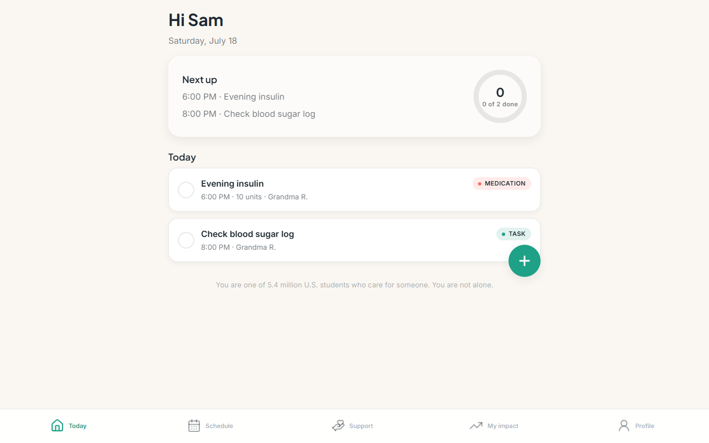
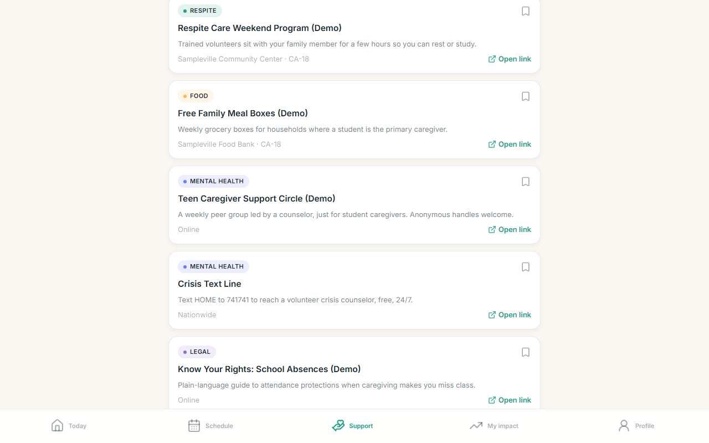
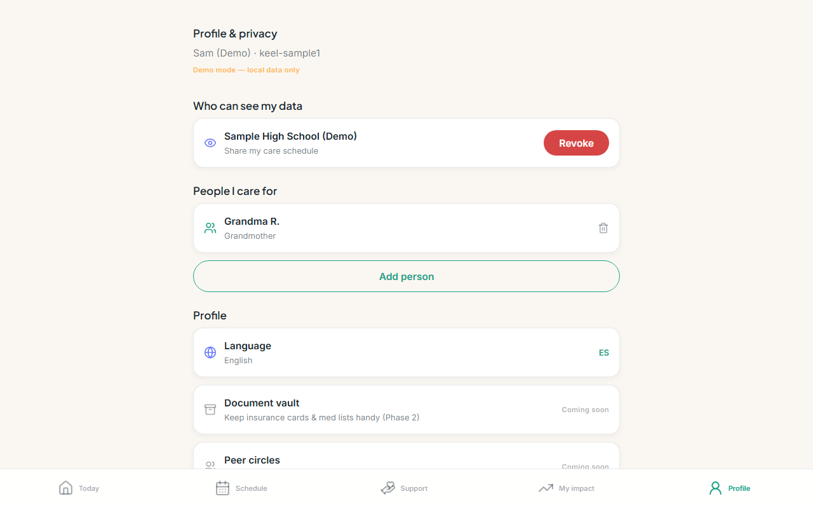

# Keel

**The first app built for the 5.4 million K-12 students in the U.S. who care for a sick, disabled, or aging family member while trying to stay in school.**

Every existing caregiver app (Medisafe, Caring Village, CareZone, Lotsa Helping Hands) is built for *adult* care coordinators. None are built for the teenager who is often the sole, untrained, invisible caregiver. Keel fills that gap — a calm, dignified daily tool plus a consent-first bridge to schools and nonprofits that can help. (Context: 2024 Johns Hopkins study on youth caregivers; 2025 U.S. GAO report directing HHS to clarify support for under-18 caregivers.)

| Today | Resources | Privacy |
| --- | --- | --- |
|  |  |  |

## The two pillars

1. **Care schedule + reminders** — medications, appointments, and recurring tasks (RFC-5545 recurrence) with real local notifications. Checking a task off logs care minutes that build an exportable "My impact" record (useful for school service credit).
2. **Verification + resource unlock** — a teen requests verification from a school/nonprofit; the org verifies; the teen *explicitly consents* before the org sees anything; verified teens unlock local resources (respite, food, mental health, legal, financial, training). Consent is revocable in one tap.

## Privacy posture

- **RLS on every table, deny-by-default** — an org sees a teen's data only after a `verified` + `consent_granted` verification row exists (see `supabase/migrations/0002_rls.sql`).
- Session tokens in **expo-secure-store** (platform keychain), never AsyncStorage.
- Optional **biometric app lock** (the device is often shared with the person being cared for).
- Anonymous handles for peer-facing surfaces; recipients are stored by alias ("Grandma R.") — no legal names, no exact DOB (age bands).
- All demo/seed data is obviously fake.

## Stack

Expo SDK 54 (expo-router, TypeScript strict) · Supabase (auth + Postgres + RLS) · TanStack Query · Zustand · react-hook-form + zod · rrule + dayjs · expo-notifications · i18next (English/Spanish) · moti/reanimated.

## Run it

```powershell
npm install
npx expo start        # i = iOS simulator/Expo Go, w = web
```

**Demo mode:** with no `.env`, the app uses an on-device demo store with two accounts —
`demo.teen@example.com` / `demo1234` and `demo.counselor@example.com` / `demo1234` — so both pillar flows are fully drivable offline.

**Real backend:** copy `.env.example` → `.env` and follow `SHIP.md` §4 (Supabase setup).
`TODO(human): create the Supabase project and fill .env — everything else is committed.`

## Repo map

- `app/` — expo-router screens: `(auth)`, `(teen)` tabs (Today, Schedule, Support, My impact, Profile), `(org)` tabs (Requests, Students, Resources)
- `components/keel/` — design system (GlassCard, TaskCard, ProgressRing, Sheet, …)
- `theme/` — tokens (warm civic palette, glass, type scale)
- `lib/` — repo layer (`local` demo / `supabaseRepo`), notifications, recurrence, i18n
- `supabase/` — migrations (schema, RLS, signup trigger) + seed
- `ops/` — Windows build-ops automation (see `ops/install-ops.ps1` / `uninstall-ops.ps1`)
- `SHIP.md` — web deploy + EAS cloud `.ipa` + SideStore install
- `DEMO.md` — the Congressional App Challenge demo script
- `DEPENDENCIES.md` — version notes
